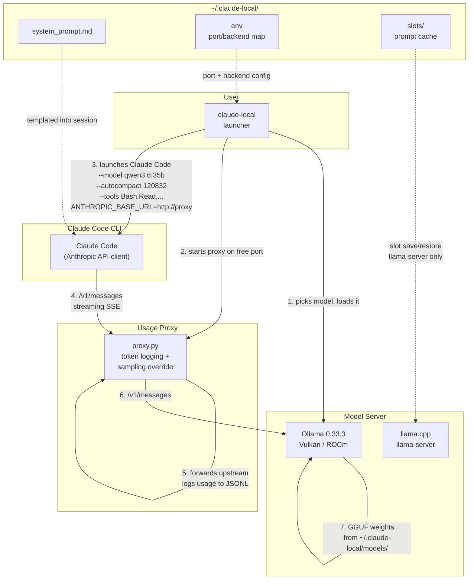
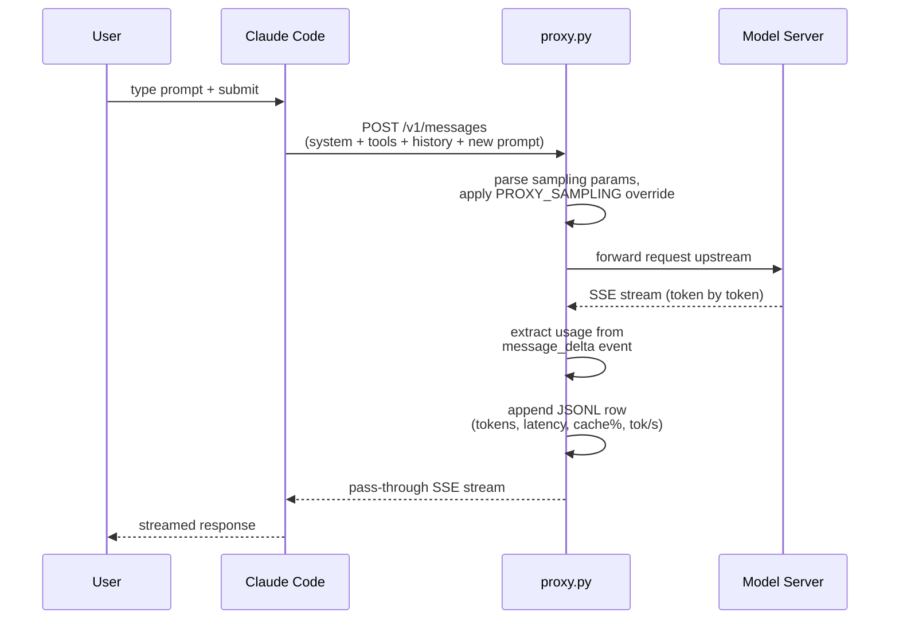

# Architecture

## System overview

## Data flow per turn

## Component map

| component | file | role |
|---|---|---|
| **Launcher** | `bin/claude-local` | Orchestrates the full lifecycle: server check, model picker, load, proxy, Claude launch, post-exit menu |
| **Usage Proxy** | `config/proxy.py` | Transparent reverse proxy; logs per-turn usage (cache hits, tok/s, latency) as JSONL for the statusline |
| **Statusline** | `config/statusline.sh` | Four-line cockpit showing uncached tokens, cache hit %, output throughput, and context gauge |
| **Model Picker** | `config/picker.py` | Interactive menu of available models; non-interactive via `CLAUDE_LOCAL_MODEL` |
| **Backend Adapter (Ollama)** | `config/backend-ollama.sh` | Ollama-specific: health check, model inventory, load/unload, context length probe |
| **Backend Adapter (llama-server)** | `config/backend-llamaserver.sh` | llama-server router mode: preset inventory with load state, `/models/load` + status polling, `/models/unload`, per-model props, slot save/restore (single-model layout still supported) |
| **Model presets (llama-server)** | `~/.claude-local/llama-models.ini` | One section per GGUF: alias, file, reasoning, speculation, sampling; `bin/llama-models-ini` appends new files; `?reload=1` re-reads it |
| **System Prompt** | `config/system_prompt.md` | Operator prompt templated with `{{MODEL}}`; appended to Claude's built-in prompt |
| **Config** | `~/.claude-local/env` | Persisted defaults: port, backend, model — written by bootstrap |

## Key design decisions

- **Isolated config directory** — `~/.claude-local/` is fully separate from `~/.claude/`. Your project-level Claude Code setup is never touched.
- **Offline by default** — `CLAUDE_LOCAL_OFFLINE=1` (default) points `HTTPS_PROXY` at a dead port with localhost bypassed. Project CLAUDE.md files still load; everything else needs explicit opt-in (`CLAUDE_LOCAL_OFFLINE=0`).
- **Autocompact fitted to server context** — Claude Code assumes 200K for unknown models. The launcher computes `autocompact = server_context - max_output(8192) - 2048` so prompt + generation always fit before compacting. Floor: 100K.
- **Attribution header disabled** — `CLAUDE_CODE_ATTRIBUTION_HEADER=0` keeps the system prompt byte-identical across turns, preserving the server's prefix cache.
- **Tool surface minimized** — default is `Bash,Read,Edit,Write,Grep,Glob`. The full tool list costs ~5K extra prompt tokens and wastes ~30% of turns on meta-tools (ReportFindings, TaskList, Skill).
