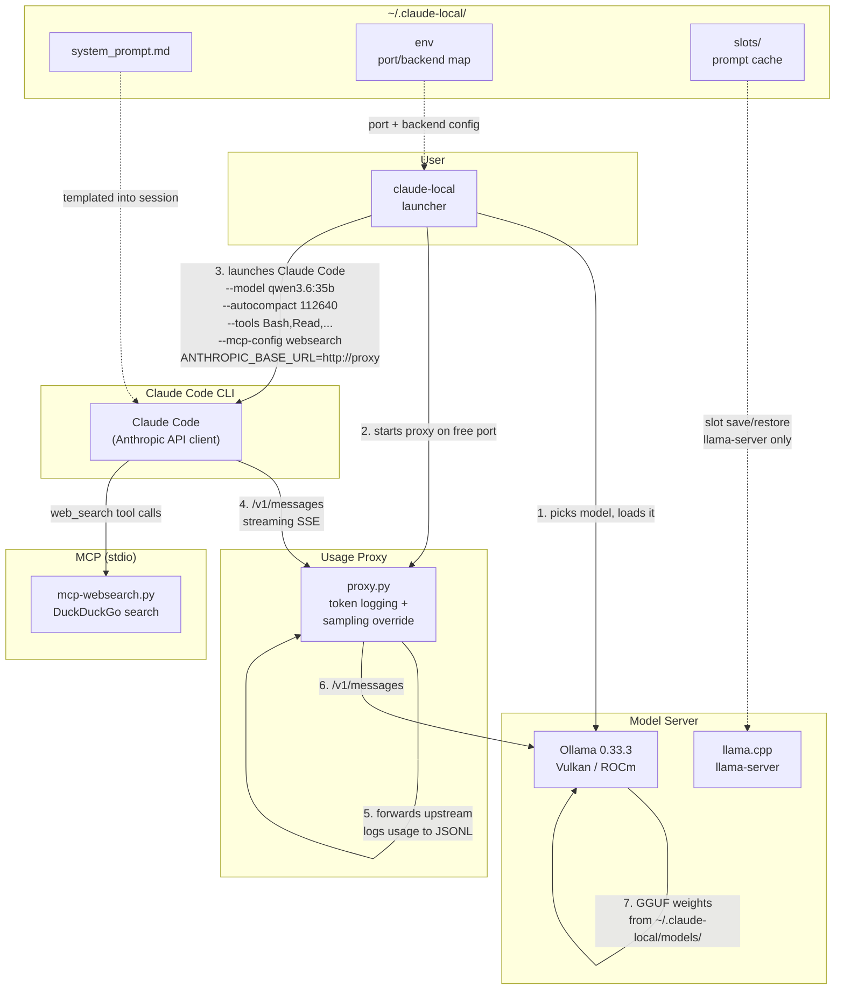
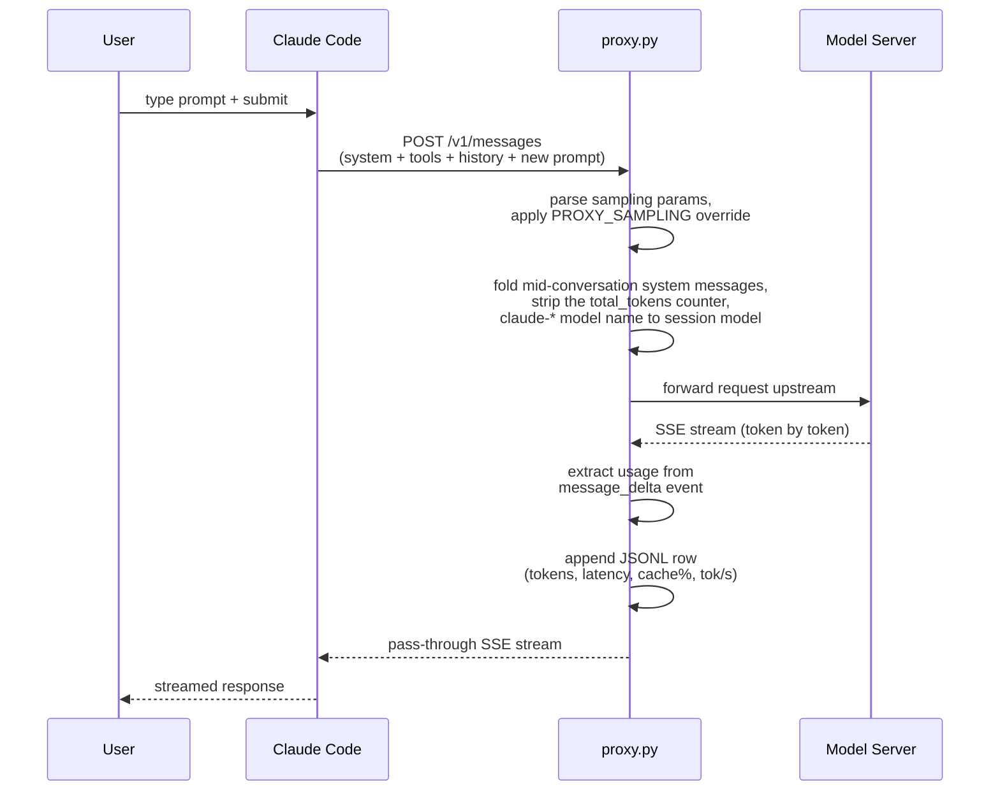

# Architecture

## System overview

## Data flow per turn

## Component map

| component | file | role |
|---|---|---|
| **Launcher** | `bin/claude-local` | Orchestrates the full lifecycle: server check, model picker, load, proxy, Claude launch, post-exit menu |
| **Usage Proxy** | `config/proxy.py` | Reverse proxy; logs per-turn usage (cache hits, tok/s, latency) as JSONL for the statusline; folds mid-conversation `role: system` messages into the system prompt and strips the `<total_tokens>` counter; rewrites a `claude-*` model name to the session's current model (the last local model a turn used, else `PROXY_SESSION_MODEL` from the launcher) and logs `model_rewritten`; checkpoints and resumes the prompt cache, idle-unloads presets nobody uses; emits every error and anomaly event |
| **Statusline** | `config/statusline.sh` | Four-line cockpit showing uncached tokens, cache hit %, output throughput, and context gauge |
| **Model Picker** | `config/picker.py` | Interactive menu of available models; non-interactive via `CLAUDE_LOCAL_MODEL` |
| **Backend Adapter (Ollama)** | `config/backend-ollama.sh` | Ollama-specific: health check, model inventory, load/unload, context length probe |
| **Web search (MCP)** | `config/mcp-websearch.py` | stdio MCP server exposing `web_search` (DuckDuckGo HTML); registered by the launcher, replaces the built-in WebSearch |
| **Backend Adapter (llama-server)** | `config/backend-llamaserver.sh` | llama-server router mode: preset inventory with load state, `/models/load` + status polling, `/models/unload`, per-model props, slot save/restore (single-model layout still supported) |
| **Model presets (llama-server)** | `~/.claude-local/llama-models.ini` | One section per GGUF: alias, file, reasoning, speculation, sampling; `bin/llama-models-ini` appends new files; `?reload=1` re-reads it |
| **System Prompt** | `config/system_prompt.md` | Operator prompt templated with `{{MODEL}}`; appended to Claude's built-in prompt |
| **Config** | `~/.claude-local/env` | Persisted defaults: port, backend, model — written by bootstrap |

## Key design decisions

- **Isolated config directory** — `~/.claude-local/` is fully separate from `~/.claude/`. Your project-level Claude Code setup is never touched.
- **Offline on request** — `CLAUDE_LOCAL_OFFLINE=1` points `HTTPS_PROXY` at a dead port with localhost bypassed. Project CLAUDE.md files still load. Default 0 since 2026-09-07 so WebFetch and the web search MCP server work.
- **Web search via MCP** — the built-in WebSearch is executed by Anthropic's API and returns nothing against a local server, so the launcher registers `config/mcp-websearch.py` (DuckDuckGo, stdio) with `--mcp-config`; `--tools` limits only the built-in set, MCP tools ride along.
- **Autocompact fitted to server context** — Claude Code assumes 200K for unknown models. The launcher computes `autocompact = server_context - max_output(16384) - 2048` so prompt + generation always fit before compacting. Floor: 100K.
- **Checkpoint and resume** — the proxy saves the model's prompt cache to disk after each idle turn and at exit, and before every turn reloads a dead preset and restores that file (or restores after a server restart). Warm state survives crashes; the launcher restores the same file at load.
- **Idle unload and one server at a time** — a shared last-use ledger lets any session's proxy checkpoint and unload a preset nobody has used for 20 minutes (never its own); the launcher evicts whatever the other backend holds at start. Two resident presets max.
- **Permission mode pinned, hosted model names never leave the box** — the launcher passes `--permission-mode acceptEdits` by default (`CLAUDE_LOCAL_PERMISSION_MODE`) and never auto: auto mode's classifier sends a ~35K-token prompt to a hosted model per evaluated tool call, which here is a 400 from the router and then the same prompt on the single slot; the isolated `settings.json` also sets `permissions.disableAutoMode`, so Shift+Tab cannot reach auto mode mid-session (Claude Code 2.1.266). The hook guard is the gate in every mode (`make check-guard`). Six internal model aliases are pinned to the session model unless already set (`ANTHROPIC_DEFAULT_{OPUS,SONNET,HAIKU}_MODEL`, `CLAUDE_CODE_AUTO_MODE_MODEL`, `CLAUDE_CODE_BG_CLASSIFIER_MODEL`, `CLAUDE_CONTEXT_COLLAPSE_MODEL`); `CLAUDE_CODE_SUBAGENT_MODEL` is left unset so a subagent takes the parent's current model and follows a mid-session `/model` switch; and the proxy rewrites any `claude-*` name that still arrives to the session's current model (`model_rewritten` event), so a hosted name only reaches the router from a session without the proxy or the launcher.
- **Attribution header disabled** — `CLAUDE_CODE_ATTRIBUTION_HEADER=0` keeps the system prompt byte-identical across turns, preserving the server's prefix cache.
- **Tool surface chosen** — since 2026-09-07 the default is the core six plus Agent, WebFetch, the todo/task tools, ProposeGoal and ReportFindings (capability over speed); the benchmark keeps `Bash,Read,Edit,Write,Grep,Glob`, measured at ~5K fewer prompt tokens and ~30% fewer meta-tool turns.
