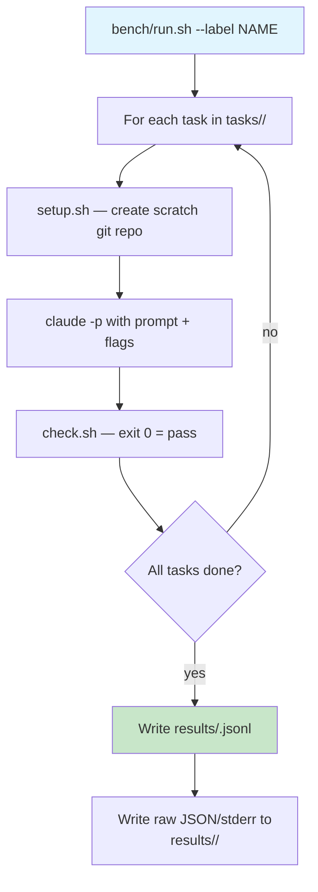

# Benchmarking

Fixed, checkable coding tasks run through `claude -p` against the local server, so every configuration change gets a number instead of an impression.

## Task harness



## Task structure

Each task lives in `tasks/<name>/` with three files:

| file | role |
|---|---|
| `setup.sh` | Creates a scratch repo with initial code state |
| `prompt.txt` | What the model is asked to do |
| `check.sh` | Validates the result (exit 0 = success) |

All runs start from a fresh `git init` of the setup, so runs are independent and reproducible.

Claude Code also keeps one transcript dir per working directory under `~/.claude-local/projects/`, named from the physical cwd with every non-alphanumeric character replaced by `-` (`bench/work/L/01-fix-bug-1` becomes `-home-<user>-dev-claude-local-bench-work-L-01-fix-bug-1`). A scratch repo's transcript is never resumed, and 623 of them (37 MB) had piled up by 2026-09-08, so `run.sh` deletes its run's dir right after `check.sh`, the offline tests delete theirs, `make clean-transcripts` sweeps what older runs left (only `projects/-tmp-*` and `*-claude-local-bench-work-*`), and `claude-local-doctor` counts them (WARN above 200).

## Running benchmarks

```bash
# Single run
cd bench && ./run.sh --label my-config -- \
    --append-system-prompt-file ~/.claude-local/system_prompt.md \
    --exclude-dynamic-system-prompt-sections \
    --autocompact 120832 \
    --tools Bash,Read,Edit,Write,Grep,Glob

# Repeat for statistical significance
./run.sh --label my-config --repeat 3 -- ...

# Through the usage proxy (per-turn data)
PROXY_PORT=1235 USAGE_LOG=/tmp/usage.jsonl python3 ../config/proxy.py &
./run.sh --label via-proxy --port 1235 -- ...

# Compare multiple runs
./compare.py label-1 label-2 label-3
```

## Recorded metrics

Each run produces a JSONL row with:

| field | meaning |
|---|---|
| `pass` | pass/fail for each task |
| `wall` | wall seconds per task |
| `turns` | number of turns (model round-trips) |
| `input` | uncached prompt tokens |
| `cache_read` | cached prompt tokens |
| `cache%` | cache hit ratio |
| `out_tok` | output tokens generated |
| `ctx` | server context length |
| `model` | model name used |
| `server_env` | server configuration |
| `stack` | the `bench/stack.sh` line, see below |

The raw rows stay on the host: since the 2026-09-06 prune, `.gitignore` keeps `bench/results/*.jsonl`, the per-run directories, proxy logs and metrics snapshots out of the repository (only `bench/results/micro/*.jsonl`, `fb-ollama-vk-core.jsonl` and `proxy/usage-fb-*.jsonl` are tracked), so the tables in the README are the record.

## Microbenchmarks

Cold prefill, decode throughput, and warm-prefix latency for both backends:

```bash
# Run microbench through proxy
PROXY_PORT=1235 USAGE_LOG=/tmp/micro.jsonl python3 ../config/proxy.py &
./microbench.py --port 1235

# Results in bench/results/micro/
```

Measures:
- **Cold prefill** — first token throughput at various context sizes (2.7K, 10K, 30K, 100K)
- **Decode** — tokens/second during generation
- **Warm prefix** — TTFT when a large cached prefix is already in the KV cache

## Full benchmark decision matrix

The full-bench uses all 9 tasks x 3 repetitions through the proxy. Results are summarized as:

| metric | what it tells you |
|---|---|
| `mean wall/task` | overall speed (includes Claude startup ~1-2s) |
| `turns/task` | how many round-trips the model needs (lower = more efficient prompting) |
| `prompt tok/task` | system prompt + tool schema cost |
| `cache%` | prefix cache effectiveness across a session |

## Stack identity

`bench/stack.sh` prints one line that `run.sh` records with every row, so a number can be tied to the software that produced it:

```
kernel=7.0.0-31-generic fw(pfp/mec/mes)=35/24/91 mesa=Mesa 26.2.2 - kisak-mesa PPA glslc=2026.3(build) vkshaders=892 llama.cpp=6a1a922d2 ollama=0.33.3 rocm=7.14
```

Fields in order: kernel, GPU firmware, Mesa, glslc, `vkshaders`, llama.cpp commit, Ollama, ROCm. Since 2026-09-08 `glslc` names the compiler that built the Vulkan backend (`Vulkan_GLSLC_EXECUTABLE` in `${LLAMA_CPP_DIR:-~/ai/llama.cpp}/build-vulkan/CMakeCache.txt`, tagged `(build)`), falling back to the one on PATH (tagged `(path)`) and `?` when neither gives a version; `vkshaders` is the number of `_q8_1` lines in `strings build-vulkan/bin/libggml-vulkan.so` (892 after the 2026-09-05 LunarG rebuild, 20 with Ubuntu's 2023.8; empty when the library is missing). Until then the field read the PATH compiler, so rows recorded between the 2026-09-05 rebuild and 2026-09-08 say `glslc 2023.8` although the backend was built with 2026.3. Mesa moved from 25.2.8 to 26.2.2 (kisak PPA) on 2026-09-06 at 11:53 (dpkg log), after the 2026-09-05/06 rows and before the 2026-09-07 Qwen3.8 rows; the Ollama baseline on the new Mesa was recorded on 2026-09-08 under the label `mesa262-ollama` (9/9, mean 27.8s, cache 96%; `compare.py mesa262-ollama fb-ollama-vk-core` reads it against the 21.4s core-allowlist run on 25.2.8; the README's Measured claims section has the reading).

## Caveats

- Wall time includes Claude startup (~1-2s)
- The first turn of every run is a full prompt-cache miss (system prompt + tool schemas, ~15K tokens), so `cache%` measures within-session reuse only
- Run with `--repeat 3` for anything where the difference is under ~20%
- Paths given to Claude flags must be absolute (Claude runs inside the scratch repo)
