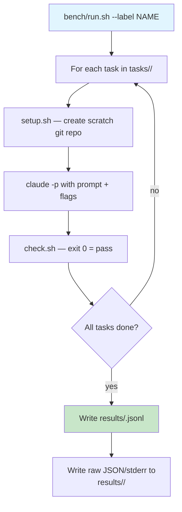

# Benchmarking

Fixed, checkable coding tasks run through `claude -p` against the local server, so every configuration change gets a number instead of an impression.

## Task harness



## Task structure

Each task lives in `tasks/<name>/` with three files:

| file | role |
|---|---|
| `setup.sh` | Creates a scratch repo with initial code state |
| `prompt.txt` | What the model is asked to do |
| `check.sh` | Validates the result (exit 0 = success) |

All runs start from a fresh `git init` of the setup, so runs are independent and reproducible.

## Running benchmarks

```bash
# Single run
cd bench && ./run.sh --label my-config -- \
    --append-system-prompt-file ~/.claude-local/system_prompt.md \
    --exclude-dynamic-system-prompt-sections \
    --autocompact 120832 \
    --tools Bash,Read,Edit,Write,Grep,Glob

# Repeat for statistical significance
./run.sh --label my-config --repeat 3 -- ...

# Through the usage proxy (per-turn data)
PROXY_PORT=1235 USAGE_LOG=/tmp/usage.jsonl python3 ../proxy.py &
./run.sh --label via-proxy --port 1235 -- ...

# Compare multiple runs
./compare.py label-1 label-2 label-3
```

## Recorded metrics

Each run produces a JSONL row with:

| field | meaning |
|---|---|
| `pass` | pass/fail for each task |
| `wall` | wall seconds per task |
| `turns` | number of turns (model round-trips) |
| `input` | uncached prompt tokens |
| `cache_read` | cached prompt tokens |
| `cache%` | cache hit ratio |
| `out_tok` | output tokens generated |
| `ctx` | server context length |
| `model` | model name used |
| `server_env` | server configuration |

## Microbenchmarks

Cold prefill, decode throughput, and warm-prefix latency for both backends:

```bash
# Run microbench through proxy
PROXY_PORT=1235 USAGE_LOG=/tmp/micro.jsonl python3 ../proxy.py &
./microbench.py --port 1235

# Results in bench/results/micro/
```

Measures:
- **Cold prefill** — first token throughput at various context sizes (2.7K, 10K, 30K, 100K)
- **Decode** — tokens/second during generation
- **Warm prefix** — TTFT when a large cached prefix is already in the KV cache

## Full benchmark decision matrix

The full-bench uses all 9 tasks x 3 repetitions through the proxy. Results are summarized as:

| metric | what it tells you |
|---|---|
| `mean wall/task` | overall speed (includes Claude startup ~1-2s) |
| `turns/task` | how many round-trips the model needs (lower = more efficient prompting) |
| `prompt tok/task` | system prompt + tool schema cost |
| `cache%` | prefix cache effectiveness across a session |

## Caveats

- Wall time includes Claude startup (~1-2s)
- The first turn of every run is a full prompt-cache miss (system prompt + tool schemas, ~15K tokens), so `cache%` measures within-session reuse only
- Run with `--repeat 3` for anything where the difference is under ~20%
- Paths given to Claude flags must be absolute (Claude runs inside the scratch repo)
