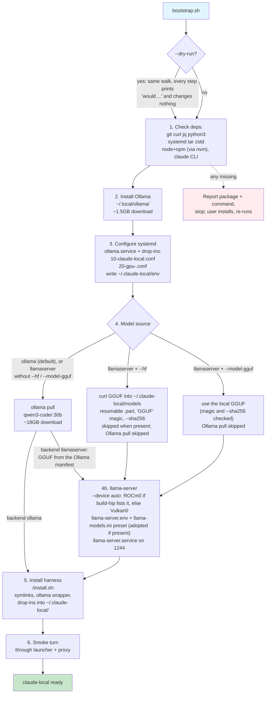
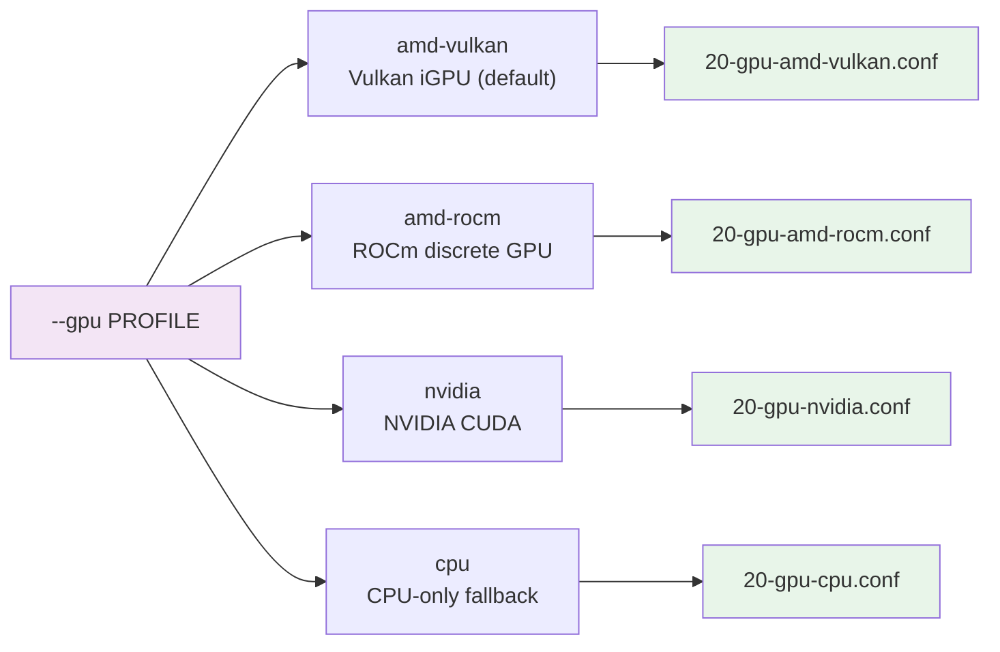

# Bootstrap flow

One command from a fresh Linux user account to a working `claude-local`:

```bash
git clone https://github.com/rogu3bear/claude-local ~/dev/claude-local && \
~/dev/claude-local/bootstrap.sh --gpu amd-vulkan --backend ollama
```

## Recommended on Strix Halo

On the Ryzen AI MAX+ 395 (gfx1151) the winner of the 2026-09-06 overnight bench is llama-server
with the Qwen3.6-35B-A3B MTP quant: 27/27 tasks, 12.3 s/task mean, against 21.4 s for Ollama with
qwen3-coder:30b on the same core tool allowlist. Bootstrap downloads the GGUF itself:

```bash
cd ~/dev/claude-local && ./bootstrap.sh --backend llamaserver \
  --hf unsloth/Qwen3.6-35B-A3B-MTP-GGUF/Qwen3.6-35B-A3B-UD-Q4_K_XL.gguf \
  --sha256 55983c5a75a1ab969824077b3bb3de4146e82a9234072b48ad4e8f92ad3fe9f1 \
  --model-gguf ~/.claude-local/models/Qwen3.6-35B-A3B-MTP-UD-Q4_K_XL.gguf
```

- Needs a built `~/ai/llama.cpp` (`--llama-cpp DIR`); bootstrap prints the build recipe and stops
  when the binary is missing.
- URL, size (22853663008 bytes) and sha256 were verified against huggingface.co on 2026-09-08.
- `--model-gguf` names the download. unsloth's non-MTP repo (`unsloth/Qwen3.6-35B-A3B-GGUF`) ships
  a different file under the same name (22360456160 bytes, another hash), and the `[qwen3.6-35b]`
  preset in `config/llama-models.ini.example` (reasoning off, `draft-mtp` n-max 2, the winning
  configuration) expects the `-MTP` name. Without `--model-gguf` the file lands under its remote
  name and gets a bare preset (`qwen3.6-35b-a3b-ud-q4_k_xl`, sampling from `[*]` only).
- The device is auto-detected (ROCm0 on this host, see below). Ollama stays installed as the
  fallback backend: `CLAUDE_LOCAL_BACKEND=ollama claude-local`.

## Steps



## Idempotency

Every step checks before acting:

| step | guard |
|---|---|
| deps | `command -v` for each dependency |
| Ollama | `~/.local/ollama/bin/ollama` present (or the binary of an adopted unit) |
| systemd unit | existing unit is **adopted** (port, binary), never overwritten |
| model pull | `ollama show MODEL` succeeds |
| GGUF download (`--hf`) | file present with the remote size (and the `--sha256`, when given): skipped. A `FILE.gguf.part` resumes with `curl -C -`. A same-name file of another size stops the script instead of overwriting it |
| llama-server files | `llama-server.env`, `llama-models.ini` and `llama-server.service` are adopted if present; only a missing preset section for the served GGUF is appended (and the running router reloaded) |
| harness install | symlinks use `-f`, drop-ins check for env changes before restarting server |

## GPU profiles (`--gpu`)

`--gpu` picks the drop-in for Ollama's runner only. llama-server chooses its own device with
`--device` (next section).



## llama-server device (`--device`)

| value | build | when |
|---|---|---|
| `auto` (default) | | ROCm0 if `$LLAMA_CPP_DIR/build-hip/bin/llama-server --list-devices` lists it, else Vulkan0 if `build-vulkan` exists; the choice and the reason are printed |
| `ROCm0` | `build-hip` | HIP. On gfx1151 it prefills Qwen3.6-35B 1.3x and Qwen3.8-27B 1.6x faster than Vulkan at equal decode (2026-09-07, `bench/results/micro/`); what this host runs |
| `Vulkan0` | `build-vulkan` | RADV; the fallback when there is no HIP build |

An explicit `--device` always wins over `auto`. An existing `~/.claude-local/llama-server.env` is
adopted, and its `LLAMA_DEVICE` is what the unit runs; bootstrap says so.

## Backend options (`--backend`)

| backend | port | extra step |
|---|---|---|
| `ollama` (default) | 1234 | None; pulls the model through Ollama. `config/settings.json` pins `ANTHROPIC_BASE_URL` to the llama-server port, so a bare `claude` with this config dir fails to connect by design (it never reaches Anthropic's API); `claude-local` sets the Ollama port itself. Bootstrap prints this warning after writing `~/.claude-local/env` |
| `llamaserver` | 1244 | Needs an upstream llama.cpp build (`--llama-cpp DIR`, default `~/ai/llama.cpp`; the recipe is printed when the binary is missing). The GGUF comes from `--hf` (download), `--model-gguf` (a file on disk) or, failing both, the Ollama manifest of the pulled model (a plain Q4_K_M without the MTP head). Optional draft model (`--draft`). Without `--model`, the model name becomes the INI alias of the GGUF |

## Key flags

```bash
./bootstrap.sh --dry-run              # walk every step, print the plan, change and download nothing
./bootstrap.sh --no-smoke             # skip the smoke turn at the end
./bootstrap.sh --model qwen3.6:35b    # Ollama model to pull (llama-server: also the preset alias)
./bootstrap.sh --port 1235            # Ollama port (default 1234); --llama-port N for llama-server (1244)
./bootstrap.sh --backend llamaserver --hf OWNER/REPO/FILE.gguf                  # download a GGUF into ~/.claude-local/models
./bootstrap.sh --backend llamaserver --hf https://huggingface.co/OWNER/REPO/resolve/main/FILE.gguf --sha256 HEX
./bootstrap.sh --backend llamaserver --model-gguf PATH                          # serve a GGUF already on disk (with --hf: save the download there)
./bootstrap.sh --backend llamaserver --device Vulkan0                           # skip the device auto-detection
```

`--hf` takes a full `resolve/main` URL or `OWNER/REPO/FILE.gguf`, which becomes that URL. The
download runs `curl -fL -C - --progress-bar` into `FILE.gguf.part` and the file is renamed only
after its size matches the server's content-length, its first four bytes read `GGUF` and the
`--sha256` (when given) matches; rerun after a network drop to resume. Single-file GGUFs only:
split `-00001-of-0000N` files are not joined. `--sha256` also verifies a `--model-gguf` file.
With `--dry-run` the step prints `would download URL (N GB) to PATH` (the size comes from a HEAD
request) and downloads nothing. `--hf` needs `--backend llamaserver`; Ollama does not serve it.

Without `--model`, the model name is the section of `~/.claude-local/llama-models.ini` whose
`model =` names the GGUF (`qwen3.6-35b` for the recommended file, with its tuned keys) or, when
the INI lacks the file, a new bare section named after the lower-cased file stem, the rule
`bin/llama-models-ini` uses. The name is what `CLAUDE_LOCAL_MODEL` and the smoke test get.
