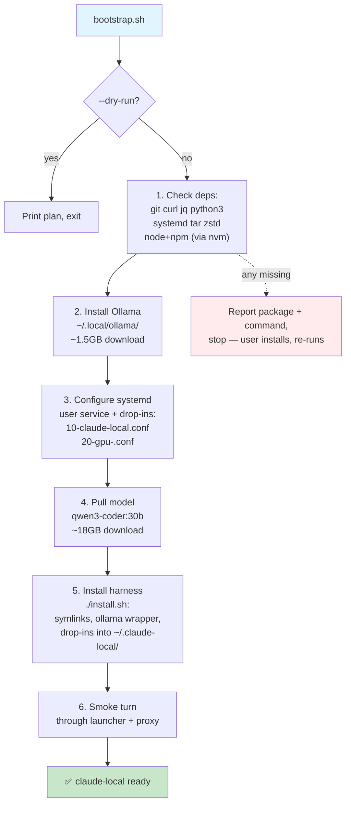
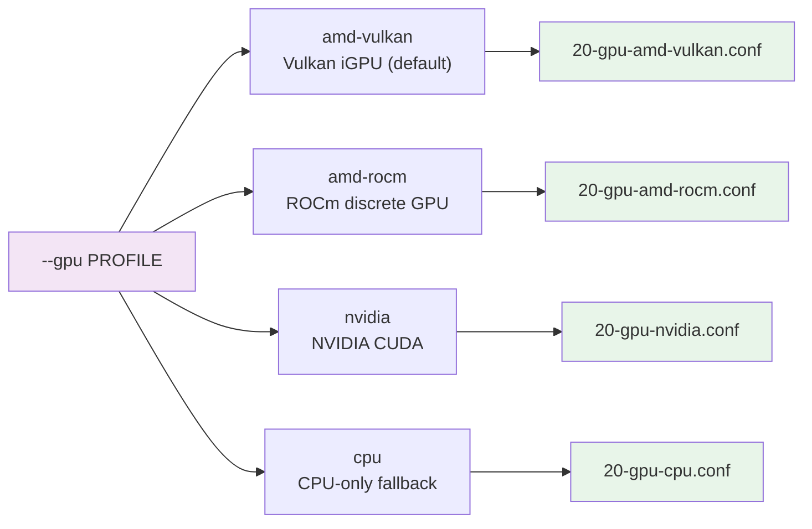

# Bootstrap flow

One command from a fresh Linux user account to a working `claude-local`:

```bash
git clone https://github.com/rogu3bear/claude-local ~/dev/claude-local && \
~/dev/claude-local/bootstrap.sh --gpu amd-vulkan --backend ollama
```

## Steps



## Idempotency

Every step checks before acting:

| step | guard |
|---|---|
| deps | `which <pkg>` for each dependency |
| Ollama | `ollama --version` — skip if already installed |
| systemd unit | existing unit is **adopted** (port, binary), never overwritten |
| model pull | `ollama list | grep <model>` — skip if present |
| harness install | symlinks use `-f`, drop-ins check for env changes before restarting server |

## GPU profiles (`--gpu`)



## Backend options (`--backend`)

| backend | port | extra step |
|---|---|---|
| `ollama` (default) | 1234 | None — pulls model via Ollama API |
| `llamaserver` | 1244 | Needs upstream llama.cpp build (`--llama-cpp DIR`), resolves GGUF from Ollama manifest, optional draft model download |

## Key flags

```bash
./bootstrap.sh --dry-run              # show plan without acting
./bootstrap.sh --no-smoke             # skip the smoke turn at the end
./bootstrap.sh --model qwen3.6:35b    # use a different model
./bootstrap.sh --port 1235            # custom port (default 1234)
```
