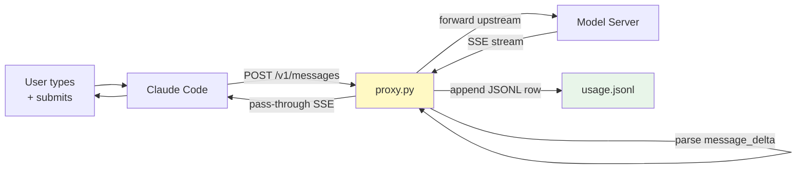
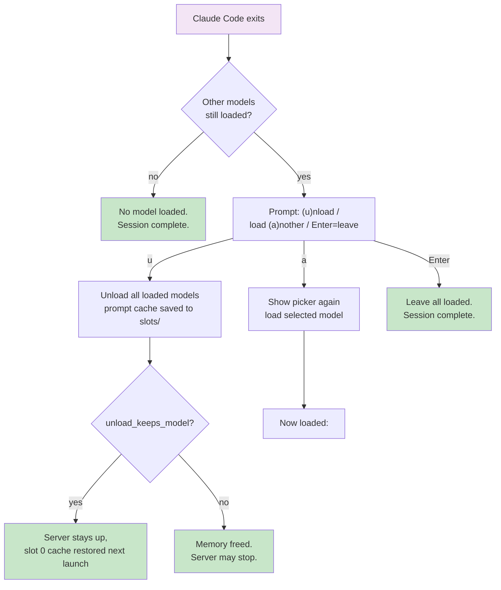
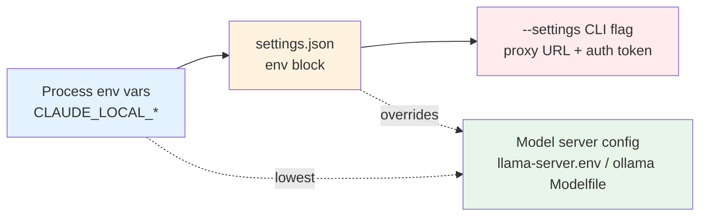
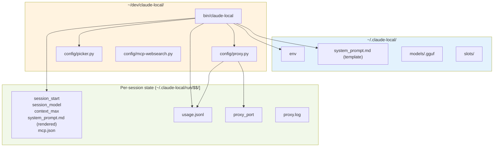

# Session lifecycle

The full flow from `claude-local` invocation to post-exit menu.

## Launch sequence

```mermaid
flowchart TD
    A["user runs<br/>claude-local"] --> B[Read ~/.claude-local/env]
    B --> C{Backend server<br/>reachable?}
    C -->|no| D[Start backend server<br/>backend_start()]
    D --> E{Server up now?}
    E -->|no| F["Wait for user to start it,<br/>then retry"]
    F --> E
    E -->|yes| G[Inventory models<br/>backend_models_json()]

    G --> H{"CLAUDE_LOCAL_MODEL<br/>set?"}
    H -->|yes| I[Use that model]
    H -->|no| J[Show picker menu<br/>picker.py]

    I --> K{Model loaded?}
    J --> K

    K -->|no| L[Load model<br/>with spinner + timer]
    K -->|yes| M["Already loaded"]

    L --> N[Start usage proxy<br/>proxy.py on free port]
    M --> N

    N --> O{Proxy bound?}
    O -->|no| P["Connect directly,<br/>skip proxy logging"]
    O -->|yes| Q["Route through proxy"]

    P --> R[Compute autocompact:<br/>ctx - max_output(8192) - 2048<br/>floor 100K]
    Q --> R

    R --> S[Render system prompt<br/>template {{MODEL}}]
    S --> T["Launch Claude Code:<br/>--model $MODEL<br/>--autocompact $AC<br/>--tools Bash,Read,...<br/>ANTHROPIC_BASE_URL=$URL"]

    style A fill:#e1f5fe
    style T fill:#fff3e0
```

## Per-turn cycle

Each user turn goes through the proxy which logs usage data:



## Post-exit menu

After Claude Code exits (Ctrl-C or normal exit), the launcher offers:



## Configuration layers

Each layer overrides the previous:



## File layout during a session


